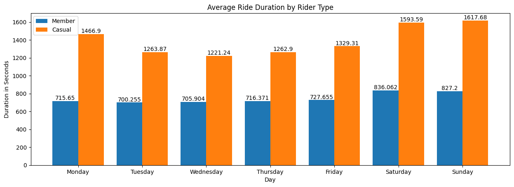
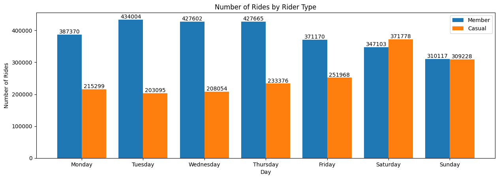

# Bike-share Analysis Case Study
The purpose of this case study is to analyze the data of a fictional company and create a recommended solution for their business needs in order to showcase my data analysis skills.

A bike-share company in Chicago named Cyclistic wants to design marketing strategies aimed at converting casual riders into annual members. In order to
do that, however, the marketing analyst team needs to better understand how annual members and casual riders differ.

**Python and Jupyter Notebook was used for the data analysis process**

## 1. Defining the business task
  * The aim of this project is to recommend at most 3 strategies that will help convert causal riders to annual members of Cyclistic. In order to conduct the analysis, bike-share data from the past 12 months needs to be utilized for the analysis. Python will be utilized for the manipulation, cleaning, analysis, and visualization of the provided data.

## 2. Description of data sources used
  * The dataset has been made available by
  **Motivate International Inc.** under this [license](https://ride.divvybikes.com/data-license-agreement).
  * The dataset to be used are the previous 12 months of bike-share data, from March 2022 to February 2023, that are in csv format.

## 3. Data cleaning / manipulation
  ### Cleaning
  * Removed rows that contain null/empty values
  * Removed rows that have negative values in ride length column
  ### Manipulation
  * Added the **ride_length** and **day_of_week** columns
  * Combined all dataframes from March 2022 to February 2023 into a single dataframe
  * Created a summarized dataframe containing the **number_of_rides**,**average_duration**,**max_duration**, and **median_duration** columns

## 4. Summary of Analysis
  * Average ride duration for a casual rider is significantly higher than a member rider's ride duration
  * The number of rides for a member rider is signifcantly higher than a casual rider from Monday to Friday
  * The number of rides for both a member and a casual rider are almost the same on a Saturday and Sunday
## 5. Visualization
  
  * The chart shows that the average duration of a ride increases on a Saturday and Sunday while the ride duration remains almost stagnant for member riders and slight increases from Monday to Friday

  
  * The chart shows that the number of rides between member and casual riders from Monday to Friday have a noticable difference while Saturday and Sunday shows almost a similar number of rides. 
## 6. Conclusion and Recommendations
  * Based on the number of rides and average duration of each ride by casual and member riders, member riders are able to utilize more of the bike-sharing system even though they use it for a short time compared to casual riders who use the bikes for a longer time but don't use it as often as it is cheaper to use the day pass for longer but not frequent rides.
  * Data on how much was charged for each ride can be used to create further analysis.
  ### Recommendations
  * The bike-share company can give a 1 week free trial of the annual membership for casual riders to try out which may influence the casual riders to continue with the membership.
  * The bike-share company can increase the time limit of their bike usage for annual memberships so casual riders will be encouraged apply for the membership.
  * The bike-share company can promote on how much casual riders can save when they are part of the annual membership especially if they are a frequent user. 